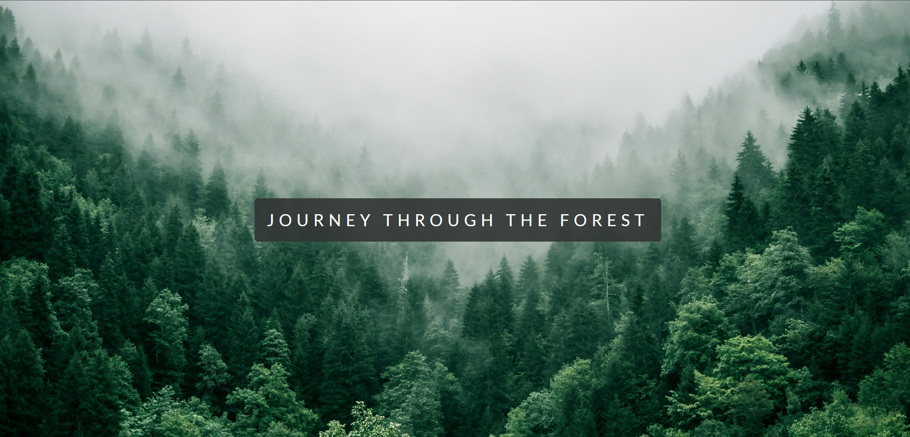

# Forest Parallax Journey

A visually captivating web experience showcasing the beauty and importance of forests through a parallax scrolling effect.

## Features

- **Parallax Scrolling:** Engaging background images that move at different speeds.
- **Informative Sections:** Detailed information on forest ecosystems, biodiversity, and conservation.
- **Animations:** Smooth fade-in and slide-in effects for a dynamic experience.
- **Responsive Design:** Adaptable layout for various screen sizes.

## Technologies Used

- HTML
- CSS
- Google Fonts (Lato)

## Screenshots



## Getting Started

### Prerequisites

- A web browser (Chrome, Firefox, etc.)

### Installation

1. Clone the repository:
   ```bash
   git clone https://github.com/SokandeSujal/forest-parallax-journey.git
   ```
2. Navigate to the project directory:
   ```bash
   cd forest-parallax-journey
   ```
3. Open `index.html` in your browser to view the project.

## File Structure

```
/forest-parallax-journey
├── images
│   └── screenshot.png  <!-- Replace with your actual images -->
├── index.html
└── styles.css
```

## Usage

- Scroll down to experience the parallax effect and read about forests.
- Hover over text elements to see interactive effects.
- Explore the conservation section for actionable steps.

## Contributing

1. Fork the repository.
2. Create a new branch:
   ```bash
   git checkout -b feature/YourFeature
   ```
3. Commit your changes:
   ```bash
   git commit -m "Add some feature"
   ```
4. Push to the branch:
   ```bash
   git push origin feature/YourFeature
   ```
5. Create a pull request.

## License

This project is licensed under the MIT License - see the [LICENSE](LICENSE) file for details.

## Acknowledgments

- Inspired by the beauty of forests and the importance of conservation.
- Special thanks to [Unsplash](https://unsplash.com/) for providing high-quality images.
